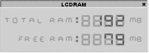



## LCDRAM

### Description

Shows the amount of free and total RAM in an picture based interface
 
### More Info
 

             |
---                |---
**Submitted On**   |2002-03-31 13:43:30
**By**             |[\[CArNi4\]](https://github.com/Planet-Source-Code/PSCIndex/blob/master/ByAuthor/carni4.md)
**Level**          |Intermediate
**User Rating**    |5.0 (20 globes from 4 users)
**Compatibility**  |VB 6\.0
**Category**       |[Windows API Call/ Explanation](https://github.com/Planet-Source-Code/PSCIndex/blob/master/ByCategory/windows-api-call-explanation__1-39.md)
**World**          |[Visual Basic](https://github.com/Planet-Source-Code/PSCIndex/blob/master/ByWorld/visual-basic.md)
**Archive File**   |[LCDRAM670693312002\.zip](https://github.com/Planet-Source-Code/carni4-lcdram__1-33252/archive/master.zip)

### API Declarations

GlobalMemoryStatus

